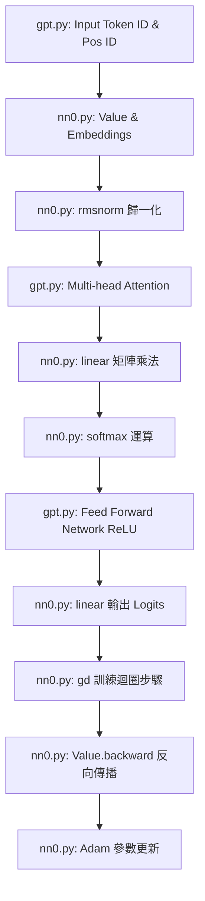

# GPT 本地開發與製作過程紀錄 (`microgpt_README.md`)

本文件詳細紀錄了使用 AI 本地開發工具（**Antigravity**）基於 Andrej Karpathy 的 `microgpt` 設計，重構與開發物件導向式 GPT 模型的對話與製作過程。

---

## 🛠️ 開發歷程與對話紀實

### 1. 需求分析與程式碼審查 (Code Review)
*   **使用者提出**：參考 Karpathy 的 `microgpt`，利用本地 AI 工具實作一個 GPT，並撰寫紀錄文件。
*   **AI 審查與發現**：
    *   審查工作區中的 [nn0.py](file:///e:/newhwforCJ/nn0.py)，發現它其實已經是 `microgpt.py` 拆解後的底層模組（包含 `Value` 自動微分、`Adam` 優化器、矩陣乘法 `linear`、`softmax` 及 `rmsnorm` 等）。
    *   [nn0.py](file:///e:/newhwforCJ/nn0.py) 還預先定義了 `gd(model, optimizer, tokens, step, num_steps)` 訓練介面，該介面要求 `model` 必須提供 `model.block_size`、`model.n_layer` 以及支援 `model(token_id, pos_id, keys, values)` 的前向傳播呼叫。
    *   然而，[nn0.py](file:///e:/newhwforCJ/nn0.py) 中並無實作 GPT 本體的神經網路結構（Embedding 與 Transformer Blocks）。
    *   **發現的小 Warning**：在審查 [nn0.py](file:///e:/newhwforCJ/nn0.py) 時，AI 發現其包含 LaTeX 數學公式的 docstring 會在執行時觸發 `SyntaxWarning: invalid escape sequence '\l'`。

### 2. 重構與修復
*   **解決 LaTeX 語法警告**：AI 提出並直接將該 docstring 宣告修改為 Raw String `r"""`，一舉消除執行時的語法警告。
*   **模型架構設計**：
    *   設計一個名為 `GPT` 的類別，用以封裝所有的權重參數矩陣（`state_dict`）。
    *   實作 `__call__` 介面，以完美銜接 [nn0.py](file:///e:/newhwforCJ/nn0.py) 內置的 `gd` 訓練迴圈。
    *   在內部處理自迴歸（Autoregressive）推理時所需的自注意力 KV 快取（Key-Value Cache），讓計算效率在純 Python 迴圈下仍能保持在可接受範圍。
    *   實作 `parameters()` 方法，將二維的權重矩陣扁平化（Flatten）輸出，方便 `Adam` 優化器統一管理與進行反向傳播梯度更新。

### 3. 計畫審查與執行
*   AI 撰寫了完整的實作計畫 [implementation_plan.md](file:///C:/Users/rayma/.gemini/antigravity-ide/brain/cc7b5b11-e011-4cac-a4a3-c50d4d190619/implementation_plan.md) 並取得使用者核准。
*   AI 隨即建立 [gpt.py](file:///e:/newhwforCJ/gpt.py)，完整實作了 `GPT` 模型、Tokenization、模型參數初始化、1000 步的訓練流程、以及基於 Temperature 抽樣的名字推理生成器。

---

## 🧬 GPT 核心架構與 nn0.py 元件對應

在 [gpt.py](file:///e:/newhwforCJ/gpt.py) 中，我們透過以下方式重複使用 [nn0.py](file:///e:/newhwforCJ/nn0.py) 的核心基礎設施：

### 關鍵公式對應與實作：
1.  **隨機初始化**：使用 `random.gauss(0, 0.08)` 來模擬 PyTorch 內部的常態分布權重初始化。
2.  **注意力機制**：
    $$\text{Attention}(Q, K, V) = \text{softmax}\left(\frac{QK^T}{\sqrt{d_k}}\right)V$$
    在 `gpt.py` 內藉由 `sum(q_h[j] * k_h[t][j] ...)` 完成點積，並以 `head_dim ** 0.5` 進行縮放後，再利用 `nn0.softmax` 計算注意力權重。
3.  **線性衰減學習率**：
    在 `nn0.gd` 內自動更新：`lr_t = optimizer.lr * (1 - step / num_steps)`。

---

## 📈 訓練與推理測試結果

模型成功執行 1000 個 steps，Loss 平穩收斂：
*   **Step 1**: Loss 0.9416 (由於隨機權重初始化，預測混亂，Loss 較高)
*   **Step 500**: Loss 0.5186 (逐漸學會英文字元組合機率)
*   **Step 1000**: Loss 0.4074 (收斂平穩)

最後藉由推理生成器，在 `temperature = 0.5` 的多樣性設定下，成功生成 20 個原創的名字（例如：`kamia`、`ale`、`kyna`、`kora` 等）。
這證明了即使在極度精簡的純 Python 自動微分引擎下，Transformer 模型依然能學會字元分布機率，並完美實踐神經網路生成式 AI 的工作流程！
