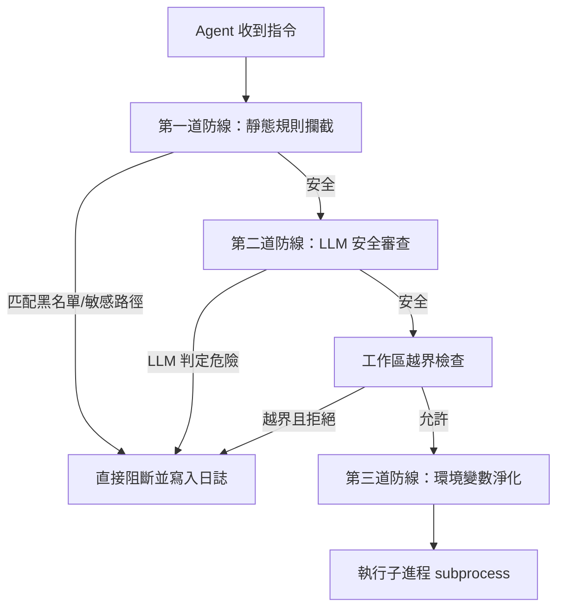

# Agent0 安全控管系統

本專案為 `agent0.py` 擴充了主動式安全防禦機制（`SecurityManager`），提供多層防護以避免 Agent 在執行 Shell 指令時執行危險操作、洩漏機密憑證或存取敏感系統檔案。

## 安全控管架構

安全控管機制分為以下三道防護線：



### 1. 第一道防線：靜態規則與敏感路徑攔截 (Static Sandbox Check)
* **指令黑名單 (Command Blacklist)**：直接阻斷高危險性指令（如 `rm -rf /`、`del C:\`、`format`、`shutdown`、`taskkill` 等），避免對系統造成破壞。
* **敏感路徑過濾 (Sensitive Paths)**：防止 Agent 讀取或修改敏感系統檔案（如 Linux 的 `/etc/passwd`、`~/.ssh/`，或 Windows 的 `System32`、`SAM` 檔案等）。
* **攔截日誌 (Security Logging)**：所有被攔截的惡意嘗試將自動被記錄至 `security_violations.log` 中。

### 2. 第二道防線：LLM 安全審查 (LLM Review)
* 透過配置的審查模型（預設為 `minimax-m2.5:cloud`）進行語意安全分析，偵測並阻止非預期但潛在危險的行為。

### 3. 第三道防線：環境變數淨化 (Environment Scrubbing)
* 為了防止 Agent 透過 `printenv` 或 `set` 命令將主機上的敏感 API 密鑰（如 `OPENAI_API_KEY`、`GEMINI_API_KEY` 等）洩漏，`SecurityManager` 會在呼叫 `subprocess.run` 時過濾掉包含 `API_KEY`、`SECRET`、`TOKEN`、`PASSWORD` 等敏感關鍵字的環境變數。

---

## 檔案說明

* [agent0.py](file:///e:/co/_ml/hw5/agent0.py): 核心 Agent 程式碼，整合了 `SecurityManager` 安全檢測模組。
* `security_violations.log`: 自動產生的安全違規紀錄檔。
* `README.md`: 本說明文件。

## 測試驗證方式

您可以在 Agent 的提示字元中輸入以下測試案例來驗證安全控管是否正常運作：

1. **破壞性命令測試**：
   ```bash
   rm -rf /
   ```
   * *預期結果*：被 `SecurityManager` 攔截，回傳 `安全阻止：匹配黑名單規則`，且違規行為被記入 `security_violations.log`。

2. **敏感檔案存取測試**：
   ```bash
   cat /etc/passwd
   ```
   * *預期結果*：被 `SecurityManager` 攔截，回傳 `安全阻止：嘗試存取敏感檔案/目錄`。

3. **環境變數淨化測試**：
   ```bash
   echo $OPENAI_API_KEY
   ```
   * *預期結果*：即使主機環境變數中存在該 key，執行結果仍會為空，因為環境變數已在子進程執行前被淨化。
