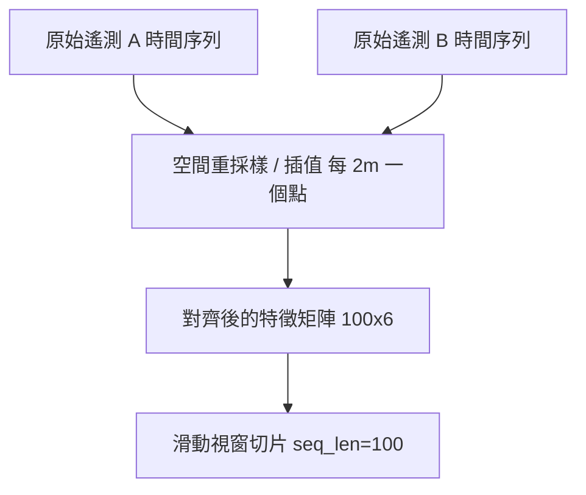
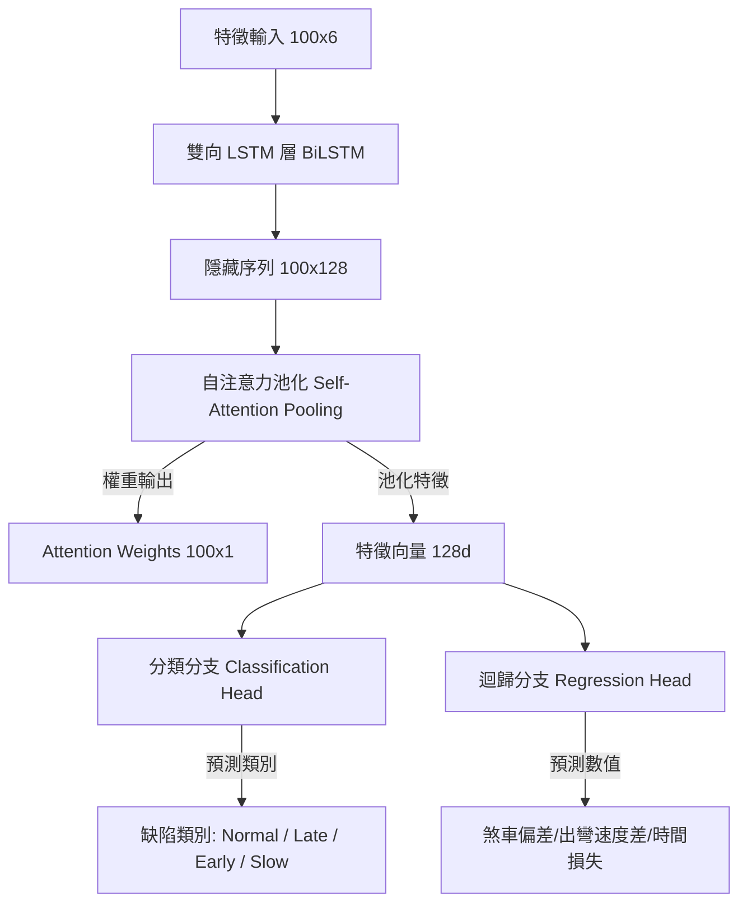

# F1 AI 遙測分析模型訓練與關鍵點定位技術說明書

本文件詳細說明 F1 AI 遙測分析平台如何透過機器學習模型，自動偵測兩位車手之間的操縱行為缺陷、預測圈速時間損失，並定位出關鍵失誤點。

---

## 1. 核心設計概念 (Core Concept)

F1 賽車遙測分析的核心挑戰在於：如何從長達數公里的時序數據中，**精確找出導致圈速落後的最關鍵操縱失誤點（例如煞車過遲/過早、出彎油門遲疑）**，並定量計算該點造成的損失時間。

本系統採用**可解釋性 AI (Explainable AI, XAI)** 的設計思路：
- 使用 **雙向 LSTM (BiLSTM)** 捕捉車手在入彎、彎心 (Apex) 至出彎加速過程中的雙向動態關聯。
- 引入 **自注意力池化機制 (Self-Attention Pooling)**，讓模型自動學習「該關注序列中的哪一個位置」。
- 透過 **Attention 權重極大值** 反向推導，定位出實體賽道上的關鍵失誤位置。

---

## 2. 數據流水線與空間對齊 (Data Pipeline & Spatial Alignment)

在時序上直接對比兩位車手會因速度不同而產生位移偏差（例如車手 A 已入彎，車手 B 還在直道）。因此，本系統採用**空間對齊**架構：

### 特徵矩陣結構
數據以固定的 $2\text{m}$ 為採樣間距進行對齊。輸入模型的每個滑動視窗長度為 $100$ 個點（涵蓋 $200\text{m}$ 賽道區間），特徵維度為 $6$：

$$\mathbf{X} = \begin{bmatrix}
V_A^{(1)} & T_A^{(1)} & B_A^{(1)} & V_B^{(1)} & T_B^{(1)} & B_B^{(1)} \\
V_A^{(2)} & T_A^{(2)} & B_A^{(2)} & V_B^{(2)} & T_B^{(2)} & B_B^{(2)} \\
\vdots & \vdots & \vdots & \vdots & \vdots & \vdots \\
V_A^{(100)} & T_A^{(100)} & B_A^{(100)} & V_B^{(100)} & T_B^{(100)} & B_B^{(100)}
\end{bmatrix}_{100 \times 6}$$

- $V_A, V_B$: 兩位車手的速度 (Speed, km/h)
- $T_A, T_B$: 兩位車手的油門開度 (Throttle, 0-100%)
- $B_A, B_B$: 兩位車手的煞車開度 (Brake, 0-100%)

---

## 3. 模型架構 (Model Architecture)

模型採用**多任務學習 (Multi-Task Learning)** 設計，同時進行「缺陷行為分類」與「量化損失指標迴歸」：

### 核心數學機制
1. **BiLSTM 時序特徵提取**
   雙向 LSTM 分別向前與向後掃描序列，輸出拼接後的特徵表示：
   $$\mathbf{h}_t = [\overrightarrow{\mathbf{h}}_t ; \overleftarrow{\mathbf{h}}_t] \in \mathbb{R}^{2 \times \text{hidden\_dim}}$$

2. **自注意力權重計算 (Self-Attention)**
   透過全連接層和 Softmax 函數計算每個位置 $t$ 的關注權重 $\alpha_t$，代表該點對整體駕駛表現的影響力：
   $$a_t = \mathbf{w}_a^T \mathbf{h}_t + b_a$$
   $$\alpha_t = \frac{\exp(a_t)}{\sum_{i=1}^{L} \exp(a_i)}$$

3. **特徵聚合 (Attention Pooling)**
   利用注意力權重對隱藏序列進行加權求和，將整個序列壓縮為固定長度的語意特徵向量 $\mathbf{s}$：
   $$\mathbf{s} = \sum_{t=1}^{L} \alpha_t \mathbf{h}_t$$

---

## 4. 缺陷合成與多任務訓練 (Defect Simulation & Multi-task Training)

為了在缺乏標註數據的情況下訓練模型，我們基於賽車動力學模擬生成缺陷样本：

| 缺陷類別 (Class) | 缺陷模擬物理邏輯 (Defect Injection) | 迴歸標籤計算公式 (Ground Truth) |
| :--- | :--- | :--- |
| **0: Normal (正常)** | 在 Driver B 的軌跡上加入輕微高斯噪聲 $\mathcal{N}(0, \sigma^2)$。 | `[0.0, 0.0, 0.0]` |
| **1: Late Braking (晚煞車)** | 將煞車點往後推遲 $8\sim20\text{m}$，入彎初期車速過高，但在彎中被迫重煞，導致出彎加油點大幅推遲。 | $\Delta t_{\text{brake}} = d_{\text{late}} / V_{\text{brake\_start}}$ $\Delta V_{\text{exit}} \in [2, 8]\text{km/h}$ $\Delta t_{\text{loss}} \in [0.15, 0.35]\text{s}$ |
| **2: Early Braking (早煞車)** | 將煞車點提前 $10\sim25\text{m}$。車手過早減速，損失入彎初期的速度。 | $\Delta t_{\text{brake}} = -d_{\text{early}} / V_{\text{brake\_start}}$ $\Delta V_{\text{exit}} \approx 0.0$ $\Delta t_{\text{loss}} \in [0.08, 0.22]\text{s}$ |
| **3: Slow Throttle (給油遲疑)** | 煞車與 Driver B 相同，但在 Apex 後的出彎加速階段，油門踩踏斜率減半（慢踩油門）。 | $\Delta t_{\text{brake}} = 0.0$ $\Delta V_{\text{exit}} \in [3, 10]\text{km/h}$ $\Delta t_{\text{loss}} \in [0.12, 0.40]\text{s}$ |

### 損失函數設計
為了平衡分類誤差（交叉熵）與數值預測誤差（均方誤差），我們引入權重因子：
$$\mathcal{L}_{\text{total}} = \mathcal{L}_{\text{CrossEntropy}}(\hat{y}_{\text{cls}}, y_{\text{cls}}) + 3.0 \times \mathcal{L}_{\text{MSE}}(\hat{\mathbf{y}}_{\text{reg}}, \mathbf{y}_{\text{reg}})$$

---

## 5. 推理與關鍵點定位演算法 (Inference & Key Point Localization)

在對整圈全新遙測進行分析時，系統執行以下演算法：

1. **滑動視窗掃描**：使用 $100$ 點寬度（$200\text{m}$）與 $20$ 點步長（$40\text{m}$）的滑動視窗對整圈數據進行前向傳播。
2. **缺陷判定**：如果預測類別 $\hat{y}_{\text{cls}} \neq 0$ 且預測時間損失 $\hat{t}_{\text{loss}} > 0.05\text{s}$，則標記為瓶頸區域。
3. **定位關鍵失誤點 (Key Event Localization)**：
   在標記的視窗內，尋找注意力權重最大值的索引點：
   $$t^* = \arg\max_{t} (\alpha_t)$$
   該點所對應的實體賽道距離 $D(t^*)$ 即為**關鍵點**。
4. **非極大值抑制 (NMS, Non-Maximum Suppression)**：
   若兩個被偵測到的瓶頸區段中心點相距小於 $250\text{m}$，則進行合併，僅保留 $\hat{t}_{\text{loss}}$ 預測值最大者。這能有效過濾重疊的警報，確保每個彎道只給出一個最精準的診斷報告。
